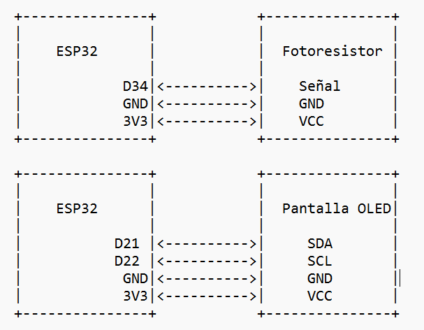
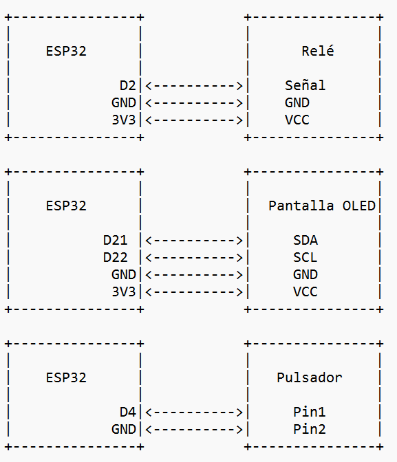

# Control de Sensor de Luz y Relé con ESP-NOW en ESP32

## Descripción del Proyecto

Este proyecto consta de dos ESP32 que se comunican entre sí utilizando ESP-NOW. El primer ESP32 está conectado a un sensor de luz (fotoresistor) y se encarga de medir la intensidad de la luz ambiente. Esta información se transmite al segundo ESP32, que está conectado a un relé. Dependiendo del modo de operación en el que se encuentre, el segundo ESP32 enciende o apaga el relé en función de los datos recibidos.


### Modo de Operación

- **Modo OA (Oscuro-Apagado)**: Si el nivel de luz recibido es 4095, el relé se apaga (estado HIGH). De lo contrario, el relé se enciende (estado LOW).
- **Modo OE (Oscuro-Encendio)**: Si el nivel de luz recibido es 4095, el relé se enciende (estado LOW). De lo contrario, el relé se apaga (estado HIGH).


**Nota:** El rango del sensor de luz es de 0 hasta 4095, siendo el primero muestra de claridad y el último de oscuridad. Sin embargo, el rango no se tiene en cuenta debido al conversor Analógico Digital del ESP32. 

**Nota:** Se puede ajustar la sensibilidad del sensor o módulo LDR variando su potenciómetro. 

**Nota:** El relé funciona con lógica inversa.

El modo se puede alternar presionando un pulsador conectado al segundo ESP32. El modo actual se muestra en una pantalla OLED.


## Diagrama del Proyecto

### Diagrama de Conexión del Primer ESP32 (Sensor de Luz)




### Diagrama de Conexión del Segundo ESP32 (Relé y Pantalla OLED)




## Requisitos de Hardware
- 2 ESP32
- 1 Sensor de luz (fotoresistor)
- 1 Relé
- 2 Pantalla OLED (SSD1306)
- 1 Pulsador
- Cables de conexión
- Protoboard (opcional)

# Instalación y Configuración

1. **Conectar el Hardware**: Sigue los diagramas de conexión proporcionados para conectar el sensor de luz, el relé, la pantalla OLED y el pulsador a los ESP32.
   
2. **Clonar el Repositorio**:

    ```sh
    git clone https://github.com/estebandenombre/ESPNOW.git
    cd tu_repositorio
    ```

3. **Cargar el Código al Primer ESP32 (Sensor de Luz)**:
   - Abre `SENSOR.ino` en el Arduino IDE.
   - Configura las opciones del ESP32 en `Herramientas`.
   - Carga el código al primer ESP32.

4. **Cargar el Código al Segundo ESP32 (Relé y Pantalla OLED)**:
   - Abre `RELE.ino` en el Arduino IDE.
   - Configura las opciones del ESP32 en `Herramientas`.
   - Carga el código al segundo ESP32.

5. **Verificar la Comunicación**:
   - Asegúrate de que ambos ESP32 estén alimentados.
   - Observa los datos recibidos en el segundo ESP32 a través del monitor serial y la pantalla OLED.
   - Alterna el modo de operación presionando el pulsador y verifica el comportamiento del relé.

# Uso del Proyecto

1. **Inicialización**:
   - Conecta y enciende ambos ESP32.
   - El segundo ESP32 mostrará el mensaje de inicialización y el modo actual en la pantalla OLED.

2. **Medición de Luz**:
   - El primer ESP32 mide continuamente el nivel de luz ambiente y transmite los datos al segundo ESP32 mediante ESP-NOW.

3. **Control del Relé**:
   - El segundo ESP32 recibe los datos de luz y controla el relé según el modo de operación.
   - Si el nivel de luz es 4095 (oscuro), el relé se enciende o apaga dependiendo del modo.

4. **Cambio de Modo**:
   - Presiona el pulsador conectado al segundo ESP32 para alternar entre los modos OA (recibiendo luz Oscura y Apagando rele) y OE (recibiendo luz Oscura y Encendiendo rele).
   - El modo actual se mostrará en la pantalla OLED.

# Contribuciones

Las contribuciones son bienvenidas. Por favor, envía un pull request con mejoras o correcciones.

# Licencia

Este proyecto está bajo la licencia de Esteban Ortiz Vicente. 

# Agradecimientos

Agradecimientos a mi cuñado que quería que su termo se encendiese o apagase en función de si sus placas solares estaban iluminadas o por el contrario, oscurecidas  por ser de noche o por estar nublado. 


