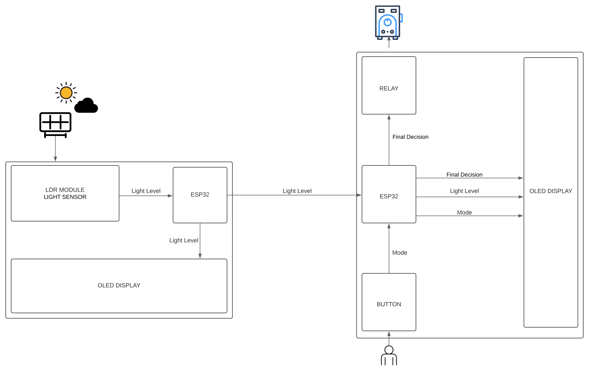
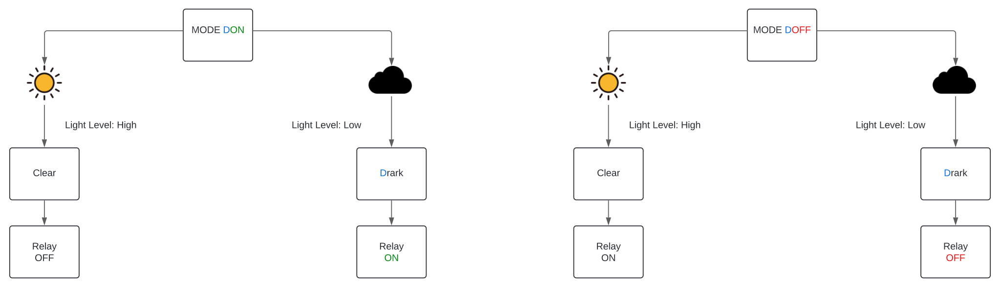

# Light Sensor and Relay Control with ESP-NOW on ESP32

## Project Description

This project consists of two ESP32s that communicate with each other using ESP-NOW. The first ESP32 is connected to a light sensor (photoresistor) and measures the ambient light intensity. This information is transmitted to the second ESP32, which is connected to a relay. Depending on the operating mode, the second ESP32 turns the relay on or off based on the received data.



### Operating Mode

- **DOFF Mode (Dark-Off)**: If the received light level is 4095 (dark), the relay turns off (HIGH state). Otherwise, the relay turns on (LOW state).
- **DON Mode (Dark-On)**: If the received light level is 4095 (dark), the relay turns on (LOW state). Otherwise, the relay turns off (HIGH state).



**Note:** The light sensor range is from 0 to 4095, with the former indicating brightness and the latter indicating darkness. However, the range is not considered due to the ESP32's Analog to Digital Converter. 

**Note:** The sensitivity of the LDR sensor or module can be adjusted by varying its potentiometer. 

**Note:** The relay operates with inverse logic.

The mode can be toggled by pressing a button connected to the second ESP32. The current mode is displayed on an OLED screen.

## Project Diagram

### Connection Diagram of the First ESP32 (Light Sensor)


### Connection Diagram of the Second ESP32 (Relay and OLED Display)


## Hardware Requirements
- 2 ESP32
- 1 Light sensor (photoresistor)
- 1 Relay
- 2 OLED displays (SSD1306)
- 1 Button
- Connecting wires
- Breadboard (optional)

# Installation and Setup

1. **Connect the Hardware**: Follow the provided connection diagrams to connect the light sensor, relay, OLED display, and button to the ESP32s.
   
2. **Clone the Repository**:

    ```sh
    git clone https://github.com/estebandenombre/ESPNOW.git
    cd your_repository
    ```

3. **Upload the Code to the First ESP32 (Light Sensor)**:
   - Open `SENSOR.ino` in the Arduino IDE.
   - Configure the ESP32 options in `Tools`.
   - Upload the code to the first ESP32.

4. **Upload the Code to the Second ESP32 (Relay and OLED Display)**:
   - Open `RELE.ino` in the Arduino IDE.
   - Configure the ESP32 options in `Tools`.
   - Upload the code to the second ESP32.

5. **Verify Communication**:
   - Ensure both ESP32s are powered.
   - Observe the data received on the second ESP32 through the serial monitor and the OLED display.
   - Toggle the operating mode by pressing the button and verify the relay behavior.

# Project Usage

1. **Initialization**:
   - Connect and power both ESP32s.
   - The second ESP32 will display an initialization message and the current mode on the OLED screen.

2. **Light Measurement**:
   - The first ESP32 continuously measures the ambient light level and transmits the data to the second ESP32 via ESP-NOW.

3. **Relay Control**:
   - The second ESP32 receives the light data and controls the relay according to the operating mode.
   - If the light level is 4095 (dark), the relay turns on or off depending on the mode.

4. **Mode Change**:
   - Press the button connected to the second ESP32 to toggle between OA mode (Dark-Off) and OE mode (Dark-On).
   - The current mode will be displayed on the OLED screen.

# Contributions

Contributions are welcome. Please send a pull request with improvements or corrections.

# License

This project is licensed under Esteban Ortiz Vicente.

# Acknowledgements

Thanks to my brother-in-law who wanted his thermos to turn on or off depending on whether his solar panels were illuminated or darkened by night or cloudy weather.

---
